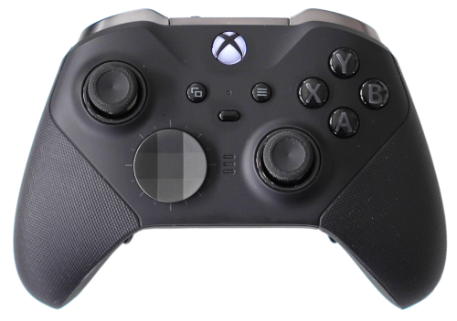

.. pybricks-requirements:: pybricks-iodevices

:mod:`iodevices <pybricks.iodevices>` -- Appareils personnalisés
================================================================

.. module:: pybricks.iodevices

.. toctree::
   :maxdepth: 1
   :hidden:

   pupdevice
   lwp3device
   xboxcontroller

Ce module contient des classes pour les appareils d'entrée/sortie génériques
et personnalisés.

.. pybricks-classlink:: PUPDevice

.. figure:: ../../main/cad/output/iodevice-pupdevice.png
   :width: 50 %
   :target: pupdevice.html

.. pybricks-classlink:: LWP3Device

.. figure:: ../../main/cad/output/hub-lwp3.png
   :width: 80 %
   :target: lwp3device.html

.. pybricks-classlink:: XboxController

